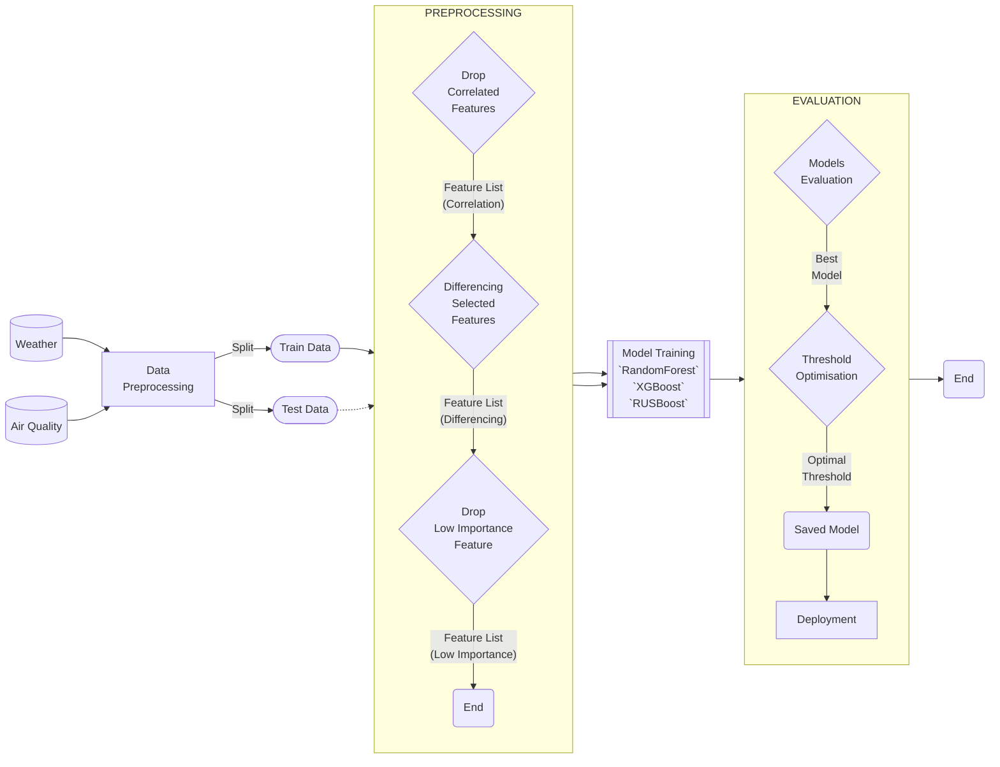

# End-to-End Machine Learning Multiclass_Classification Problem with Time-Series Weather Datasets

## Overview

This project develops an end-to-end machine learning pipeline to classify the efficiency of solar panels into three categories—Low, Medium, or High—based on weather and air quality data. This classification aids in optimizing operational planning and maintenance schedules for solar power systems, ensuring maximum efficiency and reliability.

## Repository Structure

```bash
solar-panel-efficiency/
│
├── src/                  # Contains all Python scripts for the pipeline
│   ├── data_preparation.py       # Data loading, cleaning, and preprocessing
|   ├── feature_differencing.py   # Identifying and differencing non-stationary features  
│   ├── feature_selection.py      # Feature engineering and selection
│   ├── model_training.py         # Model setup, configuration, and training
│   ├── model_evaluation.py       # Model evaluation and performance metrics
│   ├── thresholdfinder.py        # Find the optimal decision thresholds
│   ├── model_interpretation.py   # Analyzing model feature importance
│   └── main.py                   # Main script orchestrating the pipeline
│
├── config.json           # Configuration file with parameters for running the scripts
├── requirements.txt      # Python dependencies for the project
└── README.md             # Project documentation and setup instructions
```

## Setup and Execution

### Prerequisites

- Python 3.9+ installed
- pip (Python package installer)

### Environment Setup

To set up and activate a virtual environment:

1. **Clone the repository:**

   ```bash
   git clone https://github.com/sumkh/end_to_end_ml_multiclass_classification.git
   cd end_to_end_ml_multiclass_classification
   ```

   Use `cd` to move into the project directory where you want to create your environment (e.g., cd my_project)

2. **Create a virtual environment:**

   ```bash
   python3 -m venv yourenv
   ```

   Replace "env" with the name you want for your environment, like `yourenv`. This creates a folder named `yourenv` (or your chosen name) in your project directory.

3. **Activate the virtual environment:**

   ```bash
   source yourenv/bin/activate
   ```

   Replace `yourenv` if you used a different name.

4. **Install dependencies:**

   ```bash
   pip install -r requirements.txt
   ```

### Running the Pipeline

Execute the pipeline with the following command:

```bash
bash ./run.sh
```

or

```bash
python3 src/main.py
```

### Configuration

Modify parameters in `config.json` to adjust the pipeline's operation, such as dataset paths, test size, and model parameters.

### Pipeline Details



## Key Findings from Exploratory Data Analysis (EDA)

### Data Quality and Integrity

- **Missing Values and Duplicated Rows**: Significant gaps were identified in both datasets that need to be forward filled, particularly there are duplicated data despite having unique data id that need to be address before imputing the missing values and merging weather and air quality datasets. The date ranges for the datasets were aligned, but some days had missing entries, which were important for creating a continuous time series analysis.
- **Outliers and Anomalies**: Outliers observed in many of the weather data suggested possible data collection errors or extreme environmental events. Similarly, rainfall and temperature minimum, maximum readings showed occasional anomalies that needed addressing.

### Feature Distributions and Relationships

- **Sunshine Duration (hrs) and Cloud Cover (%)**: Higher sunshine duration show positive correlationship with solar panel efficiency, whereas higher Cloud Cover negatively affecting solar panel efficiency.
- **Rainfall Impact**: Days with high rainfall showed a notable decrease in panel efficiency, underscoring the impact of weather conditions on solar output.

### Seasonal and Temporal Patterns

- **Seasonality**: Both Weather and Air Quality numerical data exhibited clear seasonal trends.
- **Autocorrelation**: Environmental and meterological data are such as weather and air quality data are typically autocorrelated because of the inherent persistence of atmospheric conditions and the underlying processes that influence them. Weather patterns often last for extended periods, leading to similar measurements over time. Additionally, seasonal cycles create predictable annual variations in both weather and air quality. Pollutant accumulation and the strong influence of weather on air quality further contribute to the observed autocorrelation in these data sets.

### Correlation Analysis

- **Weather Correlates**: Humidity and cloud cover showed negative correlations with solar efficiency, whereas sunshine duration was highly positively correlated.
- **Multicollinearity**: High multicollinearity was observed between some weather features, such as between different temperature metrics and between various types of rainfall measurements. This necessitated feature engineering to reduce redundancy.

### Initial Hypotheses and Insights for Model Development

- **Feature Engineering Potential**: The relationships identified suggested substantial benefits from creating composite features, such as aggregating related weather conditions or calculating daily weather extremes.
- **Time-Seies Approach**: Given the impact of both current and historical weather conditions, incorporating time-series analysis and lag features using differencing could enhance model accuracy.
- **Feature Reduction**: Eliminate redundant features and focus on those with the most significant impact on solar efficiency to streamline the model and improve computational efficiency.

### Data Processing and Feature Engineering

Below is a table summarizing the key preprocessing steps and feature engineering techniques applied to the dataset:

| Feature                            | Description                                  | Preprocessing Actions                                                   | Rationale                                        |
|------------------------------------|----------------------------------------------|-------------------------------------------------------------------------|--------------------------------------------------|
| **Date**                           | Date when data was recorded                  | Converted to datetime format                                            | Facilitate time-series analysis                  |
| **Wet Bulb Temperature (deg F)**   | Temperature considering humidity in Fahrenheit | Converted from Fahrenheit to Celsius, negative values made absolute     | Standardize units and ensure positive values     |
| **Daily Rainfall Total (mm)**      | Total rainfall in a day                      | Missing values imputed with max_daily_rainfall, forward filled          | Capture accurate daily rainfall for efficiency analysis  |
| **Highest 30 Min Rainfall (mm)**   | Maximum rainfall in any 30-minute period     | Imputed from Highest 60 Min Rainfall, forward filled                    | Ensure completeness of short-duration rainfall data  |
| **Highest 60 Min Rainfall (mm)**   | Maximum rainfall in any 60-minute period     | Imputed from Highest 120 Min Rainfall, forward filled                   | Provide continuity and integrity in rainfall data     |
| **Highest 120 Min Rainfall (mm)**  | Maximum rainfall in any 120-minute period    | Missing values imputed from max_daily_rainfall, forward filled          | Maximize the utility of rainfall data                |
| **Min Temperature (deg C)**        | Minimum temperature of the day               | Forward filled missing values                                           | Ensure continuous temperature data for analysis  |
| **Maximum Temperature (deg C)**    | Highest temperature of the day               | Forward filled missing values                                           | Maintain data integrity for temperature analysis |
| **Min Wind Speed (km/h)**          | Minimum wind speed of the day                | Absolute values taken, forward filled                                   | Assess minimal wind conditions affecting panels  |
| **Max Wind Speed (km/h)**          | Maximum wind speed recorded on the day       | Absolute values taken, forward filled                                   | Evaluate potential wind damage or debris impact  |
| **Sunshine Duration (hrs)**        | Duration of sunshine per day                 | Missing values filled using forward fill method                         | Directly correlates with potential solar output  |
| **Cloud Cover (%)**                | Percentage of the sky covered by clouds      | Missing values imputed with forward fill                                | High cloud cover can significantly reduce efficiency |
| **Relative Humidity (%)**          | Average relative humidity for the day        | Missing values forward filled                                           | Humidity impacts panel efficiency indirectly     |
| **Air Pressure (hPa)**             | Atmospheric air pressure                     | Missing values forward filled                                           | Ensure consistent pressure readings across locations |
| **Wind Direction**                 | General direction from which the wind is coming | Placeholder values replaced with NaN, simplified categorical data encoded | Simplify for modeling, enhance interpretability |
| **Dew Point Category**             | Category of dew point temperature            | Placeholder values replaced with NaN, grouped into fewer categories, ordinal encoded | Group similar moisture conditions, reduce category complexity |
| **PM2.5 Measurements**             | Particulate matter measurements at various stations | Placeholders replaced with NaN, missing values imputed with station means, duplicate rows removed, merged into daily averages | Clean and consolidate data for accurate environmental analysis |
| **PSI Readings**                   | Pollutant Standards Index readings at various stations | Placeholders replaced with NaN, missing values imputed, duplicate rows removed, merged into daily averages | Ensure clean and comprehensive daily air quality data |
| **Daily Solar Panel Efficiency**   | Target variable: Efficiency rate of solar panels for the day | Categorized into 'Low', 'Medium', 'High' and encoded                   | Facilitate model training and prediction accuracy |

#### Additional Details

- **Wind Direction**: Placeholder values such as '-' and '--' are replaced with NaNs to prepare for data encoding. Wind directions are simplified by reducing variations (e.g., "NORTHWARD" to "N") to ensure consistency and facilitate model interpretation.
- **Dew Point Category**: Similar to Wind Direction, placeholders are removed, and categories are grouped to reduce complexity before encoding. For example, various levels of humidity like "HIGH LEVEL," "H," and "VH" are standardized to a single category "HIGH," making the data easier to manage and interpret.
- **PM2.5 and PSI**: Data is first cleaned by replacing placeholder values with NaNs to uniform the dataset. Missing values are then imputed using the average of respective stations to maintain data integrity. Duplicate records are identified and removed to prevent data redundancy. Finally, daily averages of PM2.5 and PSI are calculated by merging all station data based on the date, providing a comprehensive view of daily air quality.

In optimizing machine learning models for a task like predicting solar panel efficiency, where data can be imbalanced, the selection of algorithms and tuning of hyperparameters are crucial. Here's a structured explanation of the model selection incorporating both the rationale for choosing specific models based on their strengths and their approach to ensemble learning, as well as the rationale behind the hyperparameter choices with a focus on addressing class imbalance:

### Data Preprocessing Steps in the Pipeline

The preprocessing pipeline is crucial to ensure robust model training and limit data leakage between train and test datasets. The steps involved, particularly in the `feature_differencing.py` and `feature_selection.py` modules, play a significant role in the model's ability to generalize well on unseen data:

#### feature_differencing.py

This module focuses on handling non-stationary features through differencing, which is vital for stabilizing the mean of time series data, thus making it more predictable and easier to model.

1. **Identification of Non-Stationary Features**: The first step involves analyzing each feature to determine if it exhibits non-stationarity — this could be done through statistical tests like the Augmented Dickey-Fuller (ADF) test which checks for unit root presence.

2. **Differencing**: For identified non-stationary features, a differencing operation is performed. This involves subtracting the previous observation from the current observation. This step helps in removing trends and cycles, which are common in weather-related data. The period for differencing is generally set based on the observed data frequency and the nature of underlying trends or seasonality. For instance, a period of 30 days may be used for daily data, reflecting monthly cycles.

3. **Handling Boundaries**: During differencing, the first `n` values (where `n` is the differencing period) will be NA since there aren’t enough previous points to compute the differences. These are either filled using forward fill methods or dropped based on the approach that impacts the model the least.

#### feature_selection.py

After differencing, the `feature_selection.py` module is employed to refine the feature set by selecting those that contribute most significantly to predicting solar panel efficiency.

1. **Correlation Analysis**: Initial feature selection often involves removing highly correlated features to reduce redundancy and overfitting. This is particularly important when new differenced features are introduced, as they might closely relate to their original counterparts.

2. **Feature Importance Evaluation**: Techniques such as Random Forest or Gradient Boosting are used to assess the importance of each feature. This step is crucial to identify which features carry the most predictive power for solar panel efficiency.

3. **Reduction and Final Selection**: Based on the importance scores and business understanding, features that do not contribute significantly to model performance are removed. This step helps in reducing the model complexity and enhancing its interpretability.

### Emphasis on Handling Train and Test Data

To limit data leakage and ensure that the model generalizes well on unseen data:

1. **Separation of Train and Test Data**: All the feature differencing and selection processes are initially developed and tuned using only the training dataset. This includes identifying non-stationary features and calculating feature importance.

2. **Application to Test Data**: Once the feature set is finalized using the train data, the same differencing periods and selected features are then applied to the test data without any further recalibration. This ensures that the test data is a true stand-alone dataset that mimics new, unseen data.

3. **Cross-Validation**: During model training, cross-validation techniques are used within the train dataset to further validate model stability and performance, ensuring that no single subset of train data unduly influences model parameters.

These preprocessing steps are critical in preparing the data for modeling while ensuring robustness and preventing data leakage. By systematically applying these steps and rigorously separating the training and testing phases, SolaraTech can build predictive models that are both accurate and reliable in operational settings.

## Model Selection and Hyperparameter Search Space

### 1. **Random Forest Classifier (RF)**

**Rationale for Selection:**

- **Strengths**: Random Forest is robust against overfitting, which is common in decision trees, thanks to its ensemble approach. It handles both numerical and categorical data efficiently, making it versatile across various types of input features.
- **Bagging Approach**: Utilizes the bagging technique to create multiple decision trees on randomly drawn data subsets, averaging their predictions to improve stability and accuracy.

**Rationale for Choice of Hyperparameter Search Space:**

- **`n_estimators`**: More trees increase the ensemble's robustness but require more computational resources.
- **`max_depth`**: Controlling the depth of trees helps prevent overfitting, crucial for maintaining model generalizability.
- **`class_weight`**: Adjusting weights is vital for dealing with imbalanced datasets; it helps the model focus more on minority classes, thus balancing the influence of each class on the training process.

### 2. **XGBoost Classifier (XGB)**

**Rationale for Selection:**

- **Strengths**: XGBoost offers built-in handling of missing data, which simplifies preprocessing. It’s also known for delivering high performance and speed in model training.
- **Boosting Approach**: Applies gradient boosting framework, which sequentially builds models to specifically focus on training instances that previous models misclassified, effectively reducing bias and enhancing accuracy.

**Rationale for Choice of Hyperparameter Search Space:**

- **`n_estimators`**: Specifies the number of boosting stages, which allows the model to learn complex patterns effectively. Adequate boosting stages can drastically improve model performance.
- **`eta`** (Learning Rate): This controls the update extent of each tree, helping prevent overfitting by ensuring the model does not react too strongly to individual samples.

### 3. **RUSBoost Classifier**

**Rationale for Selection:**

- **Strengths**: Specifically designed to address class imbalance via integrating random undersampling of the majority class into the boosting process.
- **Boosting with Undersampling Approach**: By focusing on correcting the predictions of underrepresented classes, RUSBoost enhances the model's sensitivity to minority classes, ensuring balanced predictive performance.

**Rationale for Choice of Hyperparameter Search Space:**

- **`n_estimators`**: Determines the number of weak learners to use. In the context of RUSBoost, where each iteration attempts to correct imbalances further, the right number of estimators is crucial for thorough learning without overfitting.
- **`learning_rate`**: Moderating the learning rate ensures that each sequential model in the boosting process makes only incremental changes, thus fine-tuning the model's ability to generalize well to unseen data.

### Considerations for Imbalanced Classes

Each model and its hyperparameters were chosen with the goal of addressing the challenge posed by the imbalanced nature of the target classes in the dataset:

- **Random Forest's `class_weight` parameter** is set to balance or explicitly defined weights to ensure the model does not overlook the minority classes during training, an essential feature to counteract the skew towards the 'Medium' class.
- **Boosting models**, particularly XGBoost and RUSBoost, are selected for their sequential error-correcting approach, which naturally enhances focus on misclassified, often minority, instances, directly addressing the imbalance.
- **RUSBoost’s integration of undersampling** in each boosting iteration ensures an even representation of all classes, directly tackling the root cause of bias towards majority classes in traditional models.

## Evaluation of Solar Panel Efficiency Prediction Models

### Overview of Models Evaluated

The models evaluated include **Random Forest**, **XGB**, and **RUSBoost**, each employing different machine learning strategies:

The evaluation of the models developed for predicting solar panel efficiency reveals the following insights:

### Model Performance

#### 1. **Random Forest Classifier** (`random_forest`):

Utilizes an ensemble of decision trees to reduce overfitting and improve prediction robustness.

- Achieved the highest ROC AUC score on the test set (0.874), indicating strong discriminatory ability between classes.
- Demonstrated the highest mean F1 score (0.827) among the models, suggesting a well-balanced precision and recall across classes.
- The optimal thresholds for class discrimination were 0.39 for class 0, 0.56 for class 1, and 0.41 for class 2.
  
**Random Forest** shows superior performance in identifying both 'High' and 'Low' efficiency days. With the highest ROC AUC score on the test set (0.874), it also exhibits robust generalization from training to testing. The model's ability to handle the imbalanced nature of the dataset with advanced handling of class weights makes it particularly suited for operational deployment.

#### 2. **XGBoost Classifier** (`xgb`):

Leverages gradient boosting to build sequential models that aim to correct the errors of previous models, focusing on boosting the performance on misclassified data.

- Slightly lower ROC AUC score on the test set (0.863) compared to the Random Forest model but still indicates good model performance.
- The mean F1 score (0.824) is competitive, closely following the Random Forest model.
- The optimal thresholds are fairly consistent across classes, around the range of 0.37 to 0.43, reflecting its method of operation.

**XGB** performs comparably but slightly lower than Random Forest with a ROC AUC test score of 0.863. It demonstrates good capacity for handling complex non-linear relationships in the data.

#### 3. **RUSBoost Classifier** (`rusboost`):

Combines the Random Under Sampling (RUS) technique with boosting, specifically targeting class imbalance by focusing on the minority class during the training process.

- ROC AUC score on the test set (0.858) is the lowest among the three, which might reflect its focus on handling class imbalance more than maximizing the overall accuracy.
- The mean F1 score (0.822) slightly trails the other two models, suggesting a marginal compromise in balancing precision and recall.
- This model has the lowest thresholds for triggering class predictions, likely due to its design to address class imbalance aggressively.
  
**RUSBoost**, while slightly behind in ROC AUC test scores (0.858), offers valuable insights into the minority classes, potentially improving predictions in scenarios where less data is available for 'High' and 'Low' efficiency days.

#### Key Findings and Implications

- **Class Imbalance Handling**: RUSBoost, despite its lower overall AUC and F1 scores, might still be valuable in scenarios where class imbalance is more pronounced and handling it is crucial.
- **Best Model for General Use**: The Random Forest Classifier not only offers the best performance metrics but also shows robustness across different evaluation criteria (ROC AUC and F1 scores), making it the best candidate for deployment unless specific conditions favor the characteristics of the other models.
- **Overfitting**: The Random Forest model shows a perfect ROC AUC score of 1.0 on training data, indicating potential overfitting which needs to be monitored or mitigated.
- **Threshold Optimization**: Depending on the business context (e.g., the cost of false positives vs. false negatives), further tuning of the thresholds might be necessary to align the model's predictions with operational priorities.

### Evaluation Metrics and Their Importance

- **ROC AUC Score**: Measures the model's ability to discriminate between classes at various threshold settings. A higher AUC indicates a model with better prediction quality, regardless of the classification threshold.
  - Chosen due to its effectiveness in evaluating classifiers independently of the class distribution, which is particularly useful given the imbalanced nature of the dataset.

- **F1 Score**: Harmonic mean of precision and recall, providing a single score that balances both the concerns of precision (which measures the model's accuracy in identifying only relevant instances) and recall (which measures the model's ability to identify all relevant instances).
  - Selected due to its importance in balancing precision and recall, which is crucial in a scenario where both false positives and false negatives carry significant consequences.
  
  - **Thresholds**: The chosen thresholds for each class dictate the trade-off between sensitivity and specificity. Adjusting these can help in tuning the model's predictions based on operational or business needs.

- **Precision-Recall Curve (PRC)**: Useful in cases of class imbalance, this curve illustrates the trade-off between precision and recall for different threshold values.
  - These are especially relevant in the context of imbalanced datasets where positive class predictions are more critical, and thus, precision and recall become crucial metrics.

- **Confusion Matrix**: Provides a summary of the prediction results on a classification problem. The number of correct and incorrect predictions are summarized with count values and broken down by each class.

#### Analysis Based on Charts

- **Receiver Operating Characteristic (ROC) and Precision-Recall Curve (PRC)**:
  - **ROC**: The ROC curves for all classes across models show good performance with AUC scores near or above 0.8, indicating a good measure of separability between the classes.
  - **PRC**: The Precision-Recall curves show varying levels of Average Precision (AvgPrec) for different classes and models, indicating some differences in model performance at different threshold levels, particularly noticeable in lower recall values.
  - 

- **Confusion Matrix**: From the first confusion matrix, it appears the random_forest model has a relatively balanced performance across all classes, with the highest confusion between classes 0 and 2. The confusion matrix from the optimized thresholds shows adjustments in classification cutoffs can impact the true positive rates across classes, potentially increasing accuracy but possibly at the expense of increasing false positives or false negatives in other classes.
- **Without Adjusted Threshold (Random Forest)**:
  - Correct predictions for High Efficiency (Class 2) are lower (99) compared to Medium (281) and Low (160) efficiencies.
  - 
  
- **With Adjusted Threshold (Random Forest)**:
  - The adjustments lead to a slight decrease in correct predictions for High Efficiency (100) while maintaining or slightly improving accuracy for Low (158) and Medium (278) efficiencies.
  - 

- **Precision, Recall, and F1 Score vs. Threshold for Each Class**: This chart helps in understanding how adjusting the decision threshold can balance between precision and recall, optimizing for the highest F1 score. The optimal threshold for maximizing F1 score differs for each class, showing that a uniform threshold might not yield the best results for all classes. The dots indicate the position of maximum F1 score for each class.
- 

### Integration with Business Strategy

- **Operational Efficiency**: Random Forest's predictive accuracy supports SolaraTech’s strategy to optimize battery usage and maintenance scheduling. Accurately predicting 'Low' and 'High' efficiency days allows the company to allocate resources more effectively, ensuring maximum energy production and system uptime.
- **Cost Management**: By improving prediction accuracy, SolaraTech can reduce unnecessary operational expenditure on days predicted to have medium efficiency, which are less crucial to the company's strategic objectives.

### Recommendations

- **Model Optimization**: Further tuning of the Random Forest model could enhance its predictive accuracy, especially for 'Low' efficiency days which are crucial for scheduling maintenance.
- **Threshold Adjustment**: Depending on the business context (whether precision is more important than recall or vice versa), adjusting the classification threshold per class as shown in the threshold analysis can significantly affect model outcomes. It's crucial to align these thresholds with business objectives.
- **Dynamic Data Integration**: Incorporating real-time weather and air quality updates into the model could enhance its responsiveness and accuracy, providing SolaraTech with the ability to make operational decisions in real-time.

### Best Performing Model

The comprehensive evaluation shows that while all models perform well, Random Forest stands out in terms of alignment with business objectives, performance on key metrics, and operational applicability. It is recommended as the primary model for deployment to support strategic decision-making in maximizing solar power generation efficiency at SolaraTech.

## Considerations for Deploying Solar Panel Efficiency Prediction Models

Deploying machine learning models in a real-world setting like SolaraTech's solar panel efficiency prediction involves several strategic and operational considerations. These not only ensure the seamless integration of the models into the business processes but also help maintain the models' performance over time. Here are key considerations based on the characteristics of the models developed, especially focusing on the Random Forest model due to its superior performance and alignment with business objectives.

### 1. Maintenance of Historical Data

The use of differencing features (periods=30) in the models highlights the importance of maintaining historical data. Differencing is a method used to make the data stationary, which is a requirement for many time series forecasting models, as it helps highlight patterns such as seasonality:

- **Data Storage and Management**: SolaraTech needs robust data storage solutions to handle large volumes of historical weather and air quality data. Efficient data management practices are essential to ensure data quality and accessibility.
- **Historical Data for Differencing**: Since features derived from differencing play a significant role in the models, there is a need to regularly update and store data for at least 30 days to compute these features accurately. This requirement impacts the data retrieval and preprocessing steps in the operational pipeline.

### 2. Understanding Feature Importance

The feature importance extracted from the Random Forest model provides insights into which variables most significantly impact the prediction of solar panel efficiency. For example, 'Sunshine Duration (hrs)', 'max_daily_rainfall', and 'Max Wind Speed (km/h)' are top predictors:

- **Focus on Key Features**: Investing resources in accurately measuring and forecasting significant features can improve model performance. For instance, enhancing the precision of sunshine duration and rainfall measurements could lead to better predictions of panel efficiency.
- **Feature Engineering**: Exploring additional features related to highly important ones, such as different time lags or transformations of 'Sunshine Duration' and 'max_daily_rainfall', could uncover new insights and potentially increase the predictive power of the models.

### 3. Model Updating and Re-training

Given the dependence on environmental data, which is highly variable:

- **Regular Updates**: The model should be regularly updated with new data to adapt to changing weather patterns and environmental conditions. This ensures the model remains relevant and accurate over time.
- **Re-training Schedule**: Establish a schedule for periodic re-training of the model to incorporate recent data and refine predictions. Monitoring model performance over time will help determine the optimal re-training frequency.

### 4. Model Interpretability and Transparency

Ensuring the model's decisions are interpretable can build trust among stakeholders and facilitate easier troubleshooting and refinement:

- **Interpretability Tools**: Implement tools and techniques to interpret the model's predictions, such as feature importance charts and decision trees visualizations. This helps in understanding how and why certain predictions are made.
- **Documentation and Reporting**: Maintain thorough documentation of the model development process, including assumptions, feature engineering, and the rationale behind chosen parameters. Regular reporting on model performance and impacts also supports continuous improvement.

## Conclusion

The deployment of SolaraTech’s solar panel efficiency prediction models involves a comprehensive approach that extends beyond model accuracy. It encompasses strategic data management, continuous model evaluation, and integration within the existing technological framework. By addressing these considerations, SolaraTech can enhance its operational efficiency and maintain a competitive edge in the renewable energy sector.
